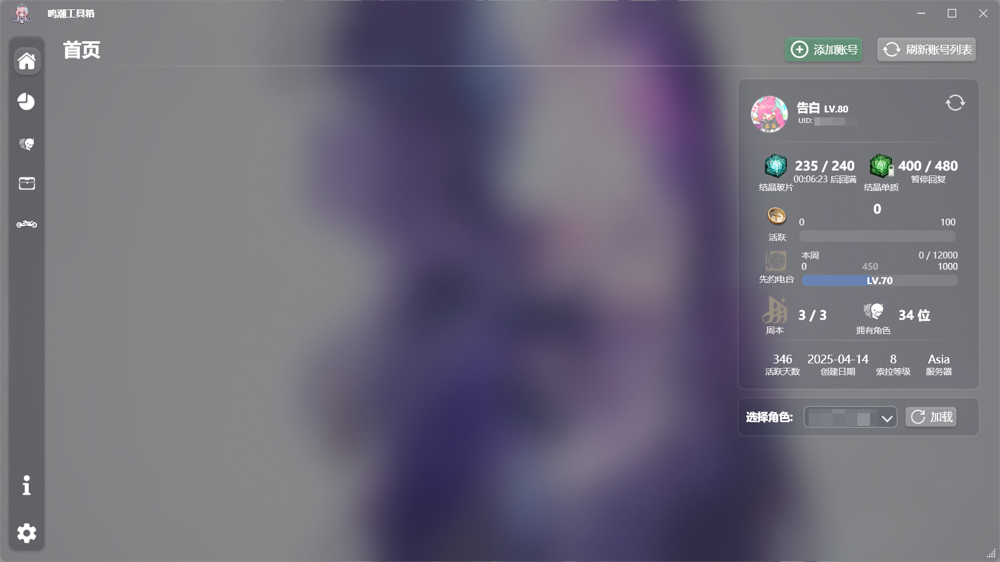
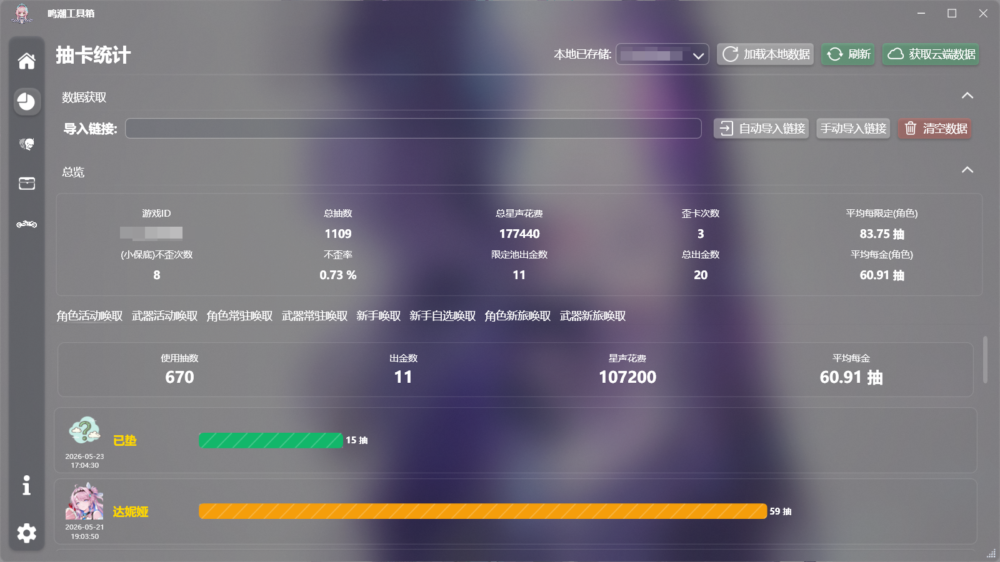
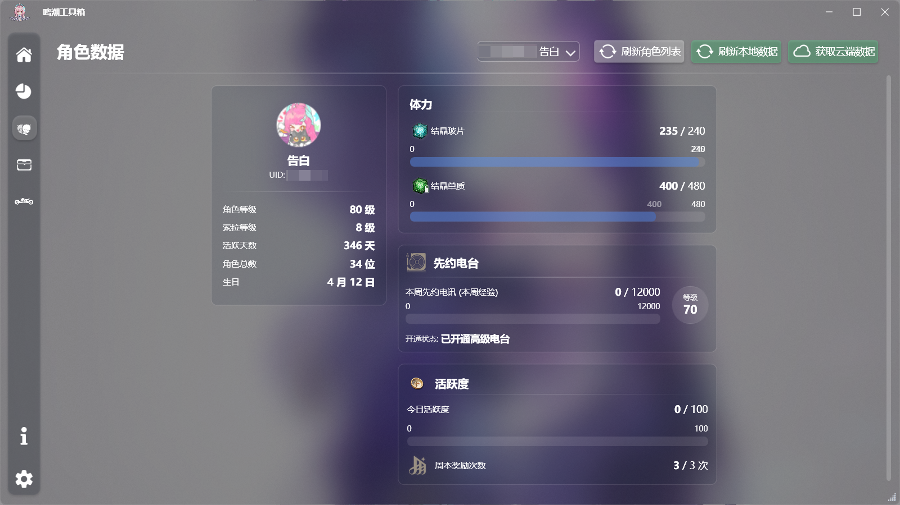
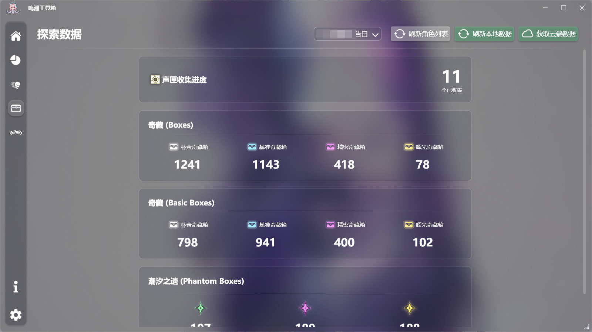
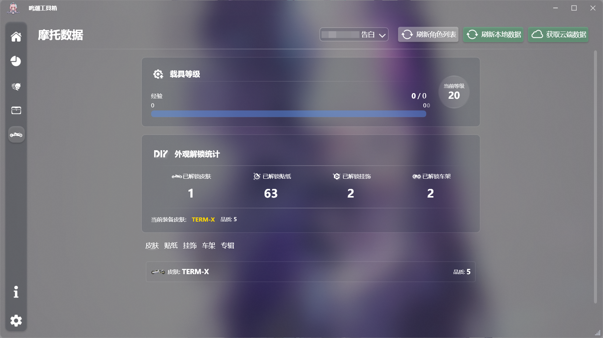

<div align="center">


## WwTool

鸣潮工具箱 · 账号资料、角色详情与抽卡统计


[](LICENSE.txt)

简体中文 | [English](WwTool/docs/README_en.md) | [日本語](WwTool/docs/README_ja.md)

[功能](#features) · [快速开始](#quick-start) · [使用流程](#usage) · [设置](#settings) · [数据与隐私](#data) · [常见限制](#limitations) · [预览](#preview) · [文档](#docs) · [更新日志](CHANGELOG.md)

</div>

用于查看《鸣潮》账号资料和整理唤取记录的 Windows 桌面工具。支持多个账号与 UID、本地数据存档，以及简体中文、英文和日文界面。

<a id="features"></a>
## 功能

| 功能 | 内容 |
| --- | --- |
| 账号概览 | 昵称、UID、等级、索拉等级、活跃情况、周本奖励次数与先约电台信息 |
| 角色资料 | 已拥有角色、共鸣链激活情况、当前装备武器；悬停卡片展示立绘和攻略站返回的部分属性 |
| 抽卡统计 | 自动或手动导入历史链接，按卡池查看出金记录、当前已垫抽数、平均出金抽数与全局汇总 |
| 统计图表 | 卡池对比、稀有度分布、抽卡时间线与活动热力图，支持筛选 |
| 探索与摩托 | 接口返回的收集数量、宝箱与潮汐之遗记录，以及摩托、外观和车载音乐解锁情况 |
| 游戏资料 | 角色、武器、摩托和音乐专辑资料按类别从本仓库同步，图片按需缓存 |

账号资料功能目前面向国际服，需通过邮箱账号密码登录；抽卡记录支持国服和国际服，可单独使用。

<a id="quick-start"></a>
## 快速开始

1. 准备 Windows 10 或以上的 x64 系统，安装 [.NET Desktop Runtime 10（Windows x64）](https://dotnet.microsoft.com/en-us/download/dotnet/10.0)。在下载页选择桌面运行时。
2. 从 [Releases](https://github.com/conFess233/WwTool/releases) 下载 `WwTool.zip`，完整解压到可写目录。
3. 运行 `WwTool.exe`。不要只移动单个 EXE，程序需要随包资源和本地数据目录。
4. 按下面的流程添加账号或导入抽卡记录。详细操作见 [使用帮助](WwTool/docs/Help.md)。

<details>
<summary>从源码编译</summary>

安装 [.NET 10 SDK](https://dotnet.microsoft.com/en-us/download/dotnet/10.0)，在 Windows 上执行：

```powershell
git clone https://github.com/conFess233/WwTool.git
cd WwTool
dotnet build WwTool/WwTool.csproj -c Release
```

运行 `WwTool/bin/Release/net10.0-windows/WwTool.exe`。也可使用支持 .NET 10 的开发环境打开 `WwTool.slnx`。

</details>

<a id="usage"></a>
## 使用流程

### 查看账号和角色

1. 在首页添加账号，输入邮箱与密码；需要验证码时，在打开的浏览器中完成验证。
2. 选择对应的 UID，获取云端数据，然后进入账号、角色、探索或摩托页面。

### 导入抽卡记录

1. 如需自动导入，在设置中选择游戏目录，并在游戏内打开一次唤取历史。
2. 在抽卡统计页面自动读取日志中的链接，或手动粘贴历史链接并选择服务器。
3. 获取云端记录后，查看总览和图表；之后可按 UID 加载已保存的本地数据。

重复导入不会重复累加同一条记录。同一时间的十连记录保留来源顺序，合法重复结果会保留。平均出金抽数统计截至最近一次出金，当前未出金的已垫抽数单独显示；没有出金记录时显示空值。

<a id="settings"></a>
## 设置

| 项目 | 用途 |
| --- | --- |
| 游戏路径 | 自动读取抽卡链接；可选择包含 `Wuthering Waves Game` 的启动器目录或游戏目录 |
| 语言与外观 | 切换中、英、日文，调整主题、强调色、毛玻璃、透明度及动效 |
| 同步游戏资料 | 立即检查四类资料，查看版本、数量、同步结果和上次成功时间；可取消同步 |
| 图片缓存 | 清空已缓存图片，之后在使用时重新下载 |

游戏资料会在启动后按各类别的上次成功时间检查，间隔为 24 小时。

<a id="data"></a>
## 数据与隐私

- 配置、账号快照和抽卡记录保存在程序目录下；更新前请退出程序并备份本地数据，避免用新压缩包覆盖存档。
- 保存的登录凭据使用 Windows DPAPI，以当前 Windows 用户加密。迁移到其他电脑或 Windows 用户后可能需要重新登录；这不代表整个数据库都已加密。
- 登录和获取云端资料需要访问对应游戏服务，静态资料同步与缺失图标下载需要访问 GitHub，半身立绘使用攻略站快照中的官方图片地址。
- 抽卡历史链接可能包含认证信息。反馈问题时请隐去密码、令牌、完整历史链接和个人账号信息。
- 图片缓存位于 `Local/Cache/Images`，默认日志位于 `Local/Logs`；清理图片缓存不会删除抽卡记录。

<a id="limitations"></a>
## 常见限制

- **资料不完整**：只展示接口实际返回的数据，不保证完整角色面板或声骸词条；未知值不会当作零。探索计数也不等同于完整地图探索度。
- **获取时间不确定**：由已有抽卡记录推导的时间只在可确定时显示；未导入记录或不适用的角色会显示未知。
- **历史记录有限**：只能导入服务端当前提供的历史，本地存档无法找回从未导入且已不再提供的记录。
- **同步失败**：网络、登录状态或接口变化可能导致获取失败；静态资料和图片更新失败时保留有效旧数据，可稍后重试。
- **图片或名称缺失**：使用已有缓存、头像或默认图回退；没有可用名称的未完成资料保留原记录并暂时跳过显示。

更多操作与问题排查见 [使用帮助](WwTool/docs/Help.md)。

<a id="preview"></a>
## 预览

以下为已有版本截图，布局和内容可能与最新版本不同。




<details>
<summary>更多页面截图</summary>






</details>

<a id="docs"></a>
## 文档与反馈

- [使用帮助](WwTool/docs/Help.md)
- [更新日志](CHANGELOG.md)
- [鸣潮 API 整理](WwTool/docs/API/WW_API.md) · [攻略站接口](WwTool/docs/API/Guide.md)
- [角色资源](WwTool/docs/Resource/Characters.md) · [武器资源](WwTool/docs/Resource/Weapons.md) · [摩托资源](WwTool/docs/Resource/Motorcycle.md)
- [游戏资料同步规则](WwTool/docs/Resource/CatalogSync.md)

遇到问题可提交 [Issue](https://github.com/conFess233/WwTool/issues)

## LICENSE

[MIT License](LICENSE.txt)。
