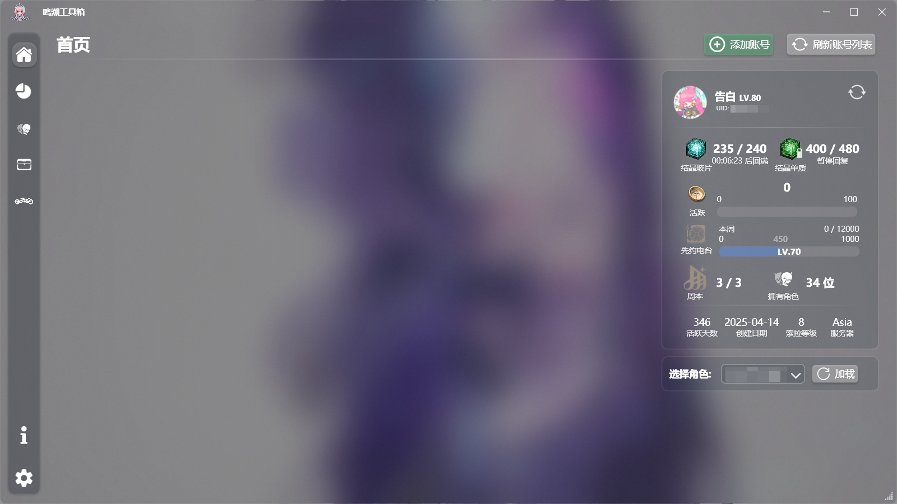
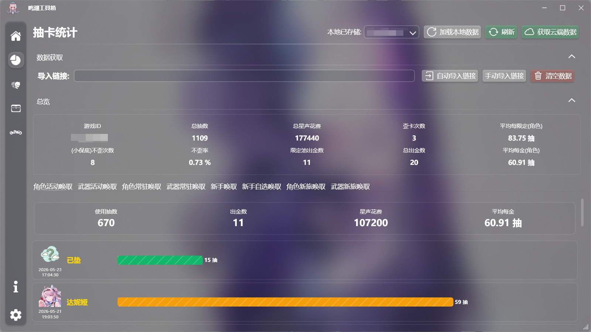
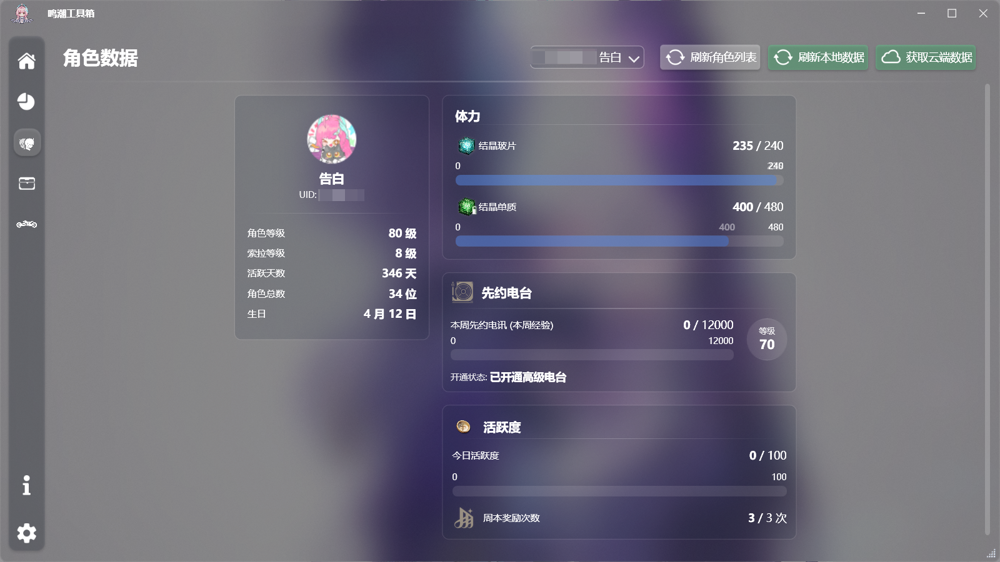
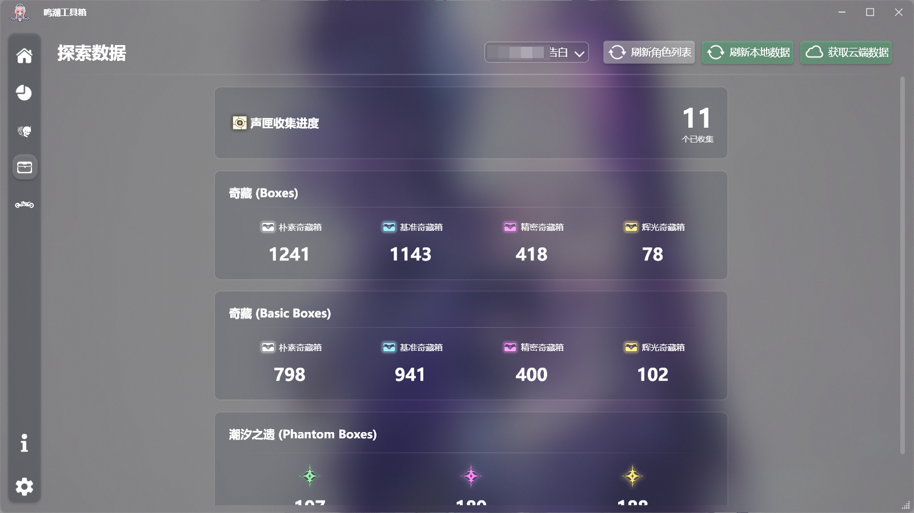
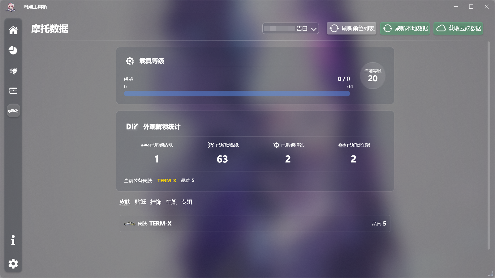

# WwTool

> Wuthering Waves Toolbox (?)

English | [日本語](./README_ja.md) | [简体中文](../../README.md)

> ⚠️ **Note**: This document was translated from Chinese by AI.

## Introduction

Since checking character information on the global server is a bit troublesome and I didn't want to use various Discord/message bots, I created this small desktop tool to easily view convene logs, world exploration progress, and more.

## Features

> Due to the lack of official open APIs for retrieving all character details on the global server, only a subset of data can be retrieved.

1. **Basic Info**
   - Avatar, nickname, UID, gender, etc.
   - Resonator level, SOL-3 Phase, unlocked resonator count, account creation date, etc.
   - Active days, daily activity, Weekly Challenge claim count, Weekly Challenge claim limit, etc.

2. **Pioneer Podcast (Battle Pass)**
   - Podcast level, EXP, activation status, premium status, etc.
   - Weekly podcast EXP progress.

3. **World Exploration**
   - Sonance Casket count (location tentative, presumed to be in inventory).
   - Opened chests count.
   - Opened Tide Heritage count.

4. **Vehicle (Motorcycle) Data**
   - Vehicle level, EXP, skins, ornaments, etc.
   - Unlocked car music albums progress.

> The above features require logging into your account. Currently only Email + Password login is supported.

5. **Convene History (Gacha logs)**
   - Retrieve convene history, analyze, and format the data.
   - Supports manual link import, as well as automatic import from local game logs after choosing the game root directory.
   - [Click here to view the tutorial](./Help_en.md)

## How to Use?

#### Out of the Box

1. Download and extract the latest `WwTool.zip` from [Releases](https://github.com/conFess233/WwTool/releases).
2. Double-click `WwTool.exe` to run.

#### Build from Source

1. Clone the repository to local: `git clone https://github.com/conFess233/WwTool.git`
2. Open `WwTool.slnx` using Visual Studio 2022 or newer, then compile/build the project.
3. Run the compiled `WwTool.exe` from the output directory.
   > Development Environment: .NET 10.0

## System Requirements

- Only supports Windows 10 and above.
- Requires .NET 10.0 Desktop Runtime installed: [Download Microsoft .NET 10.0 Runtime - Windows x64](https://builds.dotnet.microsoft.com/dotnet/WindowsDesktop/10.0.8/windowsdesktop-runtime-10.0.8-win-x64.exe)

## Documents

- [Wuthering Waves API Docs](./API/WW_API.md)
- [Resonator Resources](./Resource/Characters.md)
- [Weapon Resources](./Resource/Weapons.md)
- [Vehicle Resources](./Resource/Motorcycle.md)

## Preview

## Quick Tutorial

1. **Configure Game Path**:
   - Go to the **Settings** page.
   - In **Game Installation Directory**, click **Select Path**, select the game directory containing the `Wuthering Waves Game` folder (e.g. `D:\Wuthering Waves`), then click **Save Settings**.
2. **Sync Game Data** (Resonators, Exploration, Vehicle):
   - Switch to the **Home** page.
   - Click **Add Account**, enter your Kuro Games account **Email** and **Password** to log in.
   - _If security verification triggers, the software will automatically launch a local webpage in your default browser. Complete the slider captcha to proceed._
   - After successful login, select your UID from the dropdown list and click **Get Cloud Data** to synchronize.
3. **Sync Convene Logs**:
   - Make sure you have opened the **Convene History** screen at least once in-game.
   - Go to the **Convene Stats** page.
   - Click **Auto Import Link**. The tool will read your local log and fill in the API query link.
   - Once the UID is parsed, click **Get Cloud Data** to pull and analyze your convene history.

> For more detailed steps and troubleshooting, please refer to: [Detailed Help Guide](./Help_en.md)

## Feedback

Feedback, suggestions, or PRs are welcome via [Issues](https://github.com/conFess233/WwTool/issues).

## Known Issues

- Currently only Email + Password login is supported.
- Currently only global servers are supported (except for Convene Stats).
- Only a small amount of resonator data is retrieved, and some data (like resonator builds, Echoes, etc.) cannot be fetched.
- Since I don't own some in-game items, I haven't gathered those resources yet. They may be added in the future.

## Disclaimer

This tool is completely free and open-source. For learning and communication purposes only; do not use it for any commercial or illegal purposes. Data and UI resources are gathered via client reverse-engineering and public network resources. If there is any copyright infringement, please contact us to delete.
