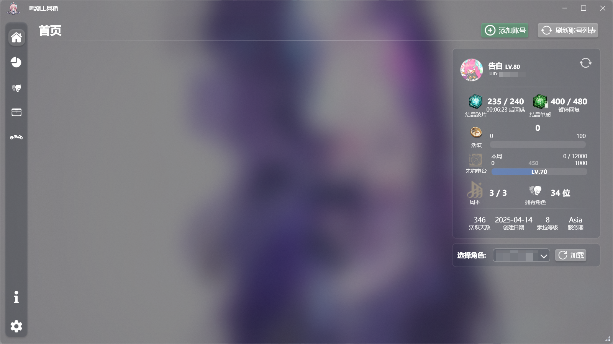
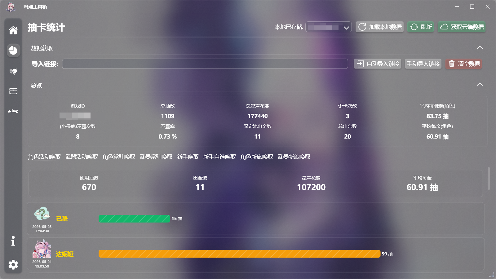
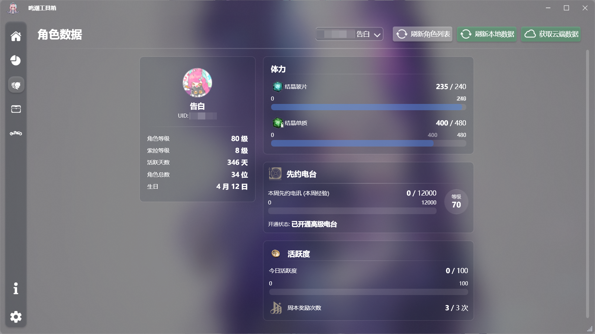
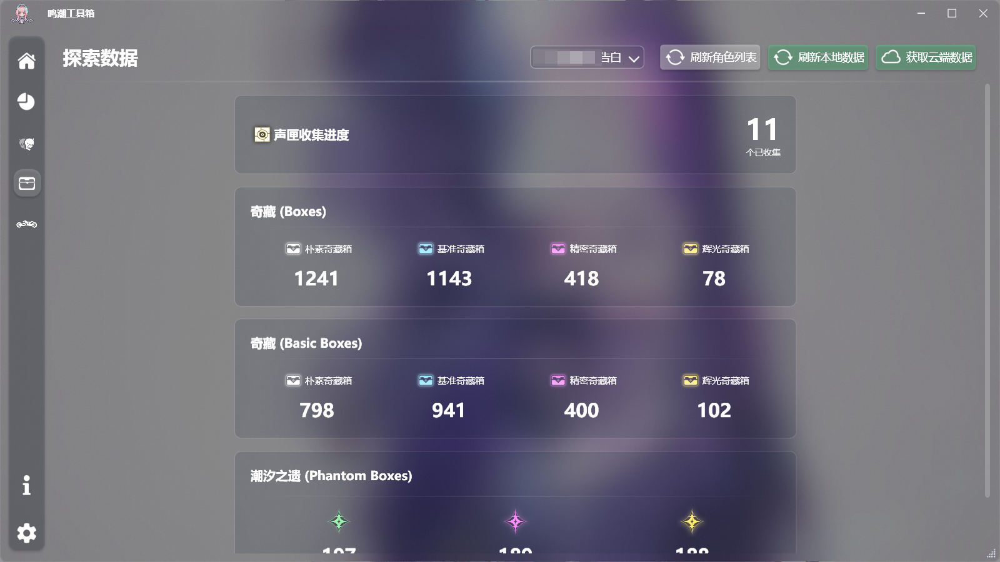
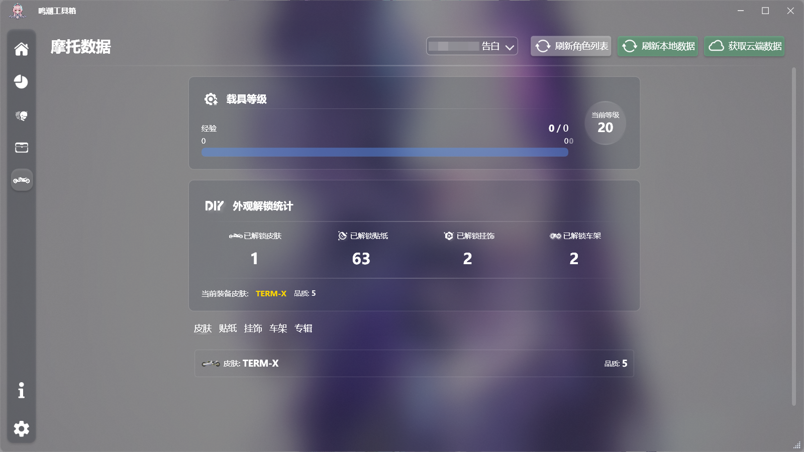

# WwTool

> 鳴潮ツールボックス(?)

[English](./README_en.md) | 日本語 | [简体中文](../../README.md)

> ⚠️ **注意**: このドキュメントは中国語からAIによって翻訳されたものです。

## 概要

グローバルサーバーでキャラクター情報を素早く確認するのが少し面倒で、各種Botを使うのも気が進まなかったため、ガチャ履歴などを手軽に確認できるデスクトップツールを自作しました。

## 機能

> 公式からグローバルサーバー向けのキャラクター全情報取得APIが公開されていないため、一部の情報のみ取得可能です。

1. **アカウント基本情報**
   - アイコン、ニックネーム、UID、性別など
   - 共鳴者レベル、ソラランク、解放済み共鳴者数、アカウント作成日など
   - アクティブ日数、デイリー活躍度、週ボス報酬受取回数 / 上限など

2. **共鳴者情報**
   - 所持している共鳴者と、装備中の武器情報
   - 各共鳴者の共鳴チェーン解放状況

3. **先約ラジオ (バトルパス)**
   - レベル、経験値、解放状態、プレミアムラジオ解放状態など
   - 今週のラジオ経験値の進捗状況

4. **エリア探索進捗**
   - ソナーの箱（声匣）の回収数（詳細は未定ですが、バッグ内のものと推測されます）
   - 開封済み宝箱の数
   - 開封済み潮汐の遺の数

5. **乗り物（バイク）データ**
   - バイクのレベル、経験値、スキン、デコレーション情報など
   - 車載音楽アルバムのアンロック状況

> ※ 以上の機能を利用するにはアカウントのログインが必要です。現在はメールアドレスとパスワードによるログインのみ対応しています。

6. **集音履歴（ガチャ履歴）**
   - 集音履歴を取得し、簡単な分析と整理を行います。
   - 手動でのリンク導入のほか、ゲームのインストールディレクトリを設定することでログファイルからリンクを自動で抽出・導入できます。
   - [チュートリアルはこちら](./Help_ja.md)

## 使用方法

#### ビルド済み版の利用（.NET 10.0 Runtime が必要）

> [Microsoft .NET 10.0 Runtime - Windows x64 をダウンロード](https://builds.dotnet.microsoft.com/dotnet/WindowsDesktop/10.0.8/windowsdesktop-runtime-10.0.8-win-x64.exe)

1. [Releases](https://github.com/conFess233/WwTool/releases) から最新の `WwTool.zip` をダウンロードし、解凍します。
2. `WwTool.exe` をダブルクリックして起動します。

#### ソースコードからのビルド

1. ソースコードをローカルにクローンします：`git clone https://github.com/conFess233/WwTool.git`
2. Visual Studio 2022 以降で `WwTool.slnx` を開き、ビルド（コンパイル）します。
3. 出力ディレクトリ内の `WwTool.exe` を実行します。
   > 開発環境: .NET 10.0

## 動作環境

- Windows 10 以降のみ対応。
- .NET 10.0 デスクトップ ランタイムのインストールが必要です：[Microsoft .NET 10.0 Runtime - Windows x64 のダウンロード](https://builds.dotnet.microsoft.com/dotnet/WindowsDesktop/10.0.8/windowsdesktop-runtime-10.0.8-win-x64.exe)

## 整理したドキュメント

- [鳴潮APIドキュメント](./API/WW_API.md)
- [キャラクターリソース](./Resource/Characters.md)
- [武器リソース](./Resource/Weapons.md)
- [バイク・その他リソース](./Resource/Motorcycle.md)

## プレビュー

## 簡単な使い方チュートリアル

1. **ゲームパスの設定**:
   - **設定（Settings）** ページに切り替えます。
   - **ゲームのインストールディレクトリ** の「選択（Select Path）」をクリックし、`Wuthering Waves Game` フォルダが含まれる『鳴潮』のインストールディレクトリ（例: `D:\Wuthering Waves`）を選択して「設定保存」をクリックします。
2. **ゲームデータの同期**（共鳴者、探索、バイク）:
   - **ホーム（Home）** ページに切り替えます。
   - 「アカウント追加」をクリックし、**メールアドレス** と **パスワード** を入力してログインします。
   - _※ セキュリティ検証（パズル認証）が発生した場合は、自動で開くブラウザ画面でスライドパズルを完了してください。_
   - ログイン成功後、プルダウンメニューから対象の UID を選択し、「クラウドデータ取得」をクリックしてデータを同期します。
3. **集音履歴の同期**:
   - 事前にゲーム内で**少なくとも1回**は集音履歴（ガチャ履歴）画面を開いておきます。
   - **集音統計（Convene Stats）** ページに切り替えます。
   - 「リンク自动导入（リンク自動導入）」をクリックすると、ログから集音 API リンクが自動的に抽出され入力されます。
   - UIDが解析されたら「クラウドデータ取得」をクリックすると、集音履歴が取得され、詳細な統計分析が始まります。
4. **表示言語の切り替え**:
   - **設定（Settings）** ページに切り替えます。
   - **画面設定（Interface Settings）** の中の **表示言語（Display Language）** を探します。
   - お好みの言語（日本語、English、简体中文など）を選択し、画面右下の **設定保存（Save Settings）** をクリックします。

> より詳細な手順やFAQについては、[詳細チュートリアル](./Help_ja.md) をご参照ください。

## フィードバック

ご提案やバグ報告は [Issues](https://github.com/conFess233/WwTool/issues) または PR の送信にて歓迎いたします。

## 既知の不具合

> 多くの機能は作者個人のアカウントでのみテストされているため、実際の利用時にさまざまな不具合が発生する可能性があります。

- 現在はメールアドレスとパスワードによるログインのみ対応しています。
- 現在はグローバルサーバーのみ対応しています（集音統計機能を除く）。
- 取得できる共鳴者データは限られており、共鳴者のステータスや音骸の詳細ステータスなど、一部の情報は取得できません。
- 一部のゲームアイテムを所持していないため、それらのリソースデータ収集を行っていません。将来的に追加される可能性があります。

## 更新履歴

- 2026/06/10：Version 3.4 の集音プールリソースを更新し、ログファイル読み込み時のエラーと複数のテキスト不具合を修正しました。
- 2026/06/20：集音データのグラフ統計機能を追加し、メモリ使用量を最適化しました。
- 2026/08/06：対象アカウントが所持する共鳴者、装備中の武器、共鳴チェーンを取得する機能を追加しました。UIを改善し、攻略サイトAPIを追加して、Version 3.5 のリソースを同期しました。

#### 今後の開発予定

- [ ] ホーム画面にゲームのお知らせ取得機能を追加する。
- [ ] カスタム背景を追加する。
- [ ] ゲームのスクリーンショットフォルダをすばやく開く、復号済みログをワンクリックで取得するなどの便利機能を追加する。
       ...

## 免責事項

本ツールは完全に無料でオープンソースです。学習・技術交流目的でのみ提供されており、商用利用や違法行為への使用は固く禁じます。使用しているデータおよびUIリソースは、クライアントの解析または公開されているネットワーク資料から取得したものです。著作権侵害などの問題がある場合は削除いたします。
